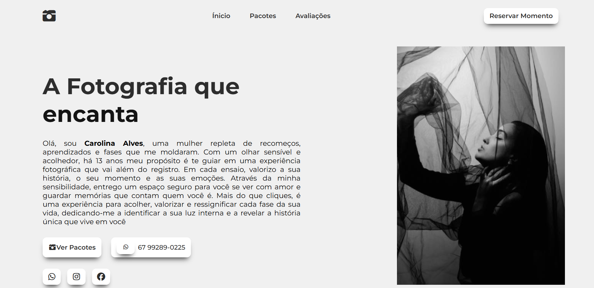

✨ Funcionalidades
Design Responsivo: Totalmente adaptável para visualização em desktops, tablets e celulares.

Menu de Navegação Fixo: O menu acompanha o usuário durante a rolagem da página, garantindo fácil acesso às seções.

Menu Mobile: Menu "hamburger" funcional para uma experiência de usuário otimizada em telas menores.

Animações de Scroll (Scroll Reveal): Elementos da página surgem suavemente conforme o usuário rola, implementado com a Intersection Observer API para máxima performance.

Links de Contato: Acesso rápido para contato via WhatsApp e redes sociais.

🚀 Tecnologias Utilizadas
Este projeto foi construído utilizando as seguintes tecnologias:

HTML5: Para a estrutura semântica da página.

CSS3: Para a estilização, utilizando:

Flexbox para o layout.

Media Queries para a responsividade.

Variáveis CSS (Custom Properties) para fácil manutenção de temas e valores.

Transitions para animações suaves.

JavaScript (Vanilla JS): Para a interatividade, incluindo:

Manipulação do DOM para o menu mobile.

Intersection Observer API para o efeito de scroll reveal.

✍️ Autor
Desenvolvido por José William.

GitHub: @JoseWilliamRF
